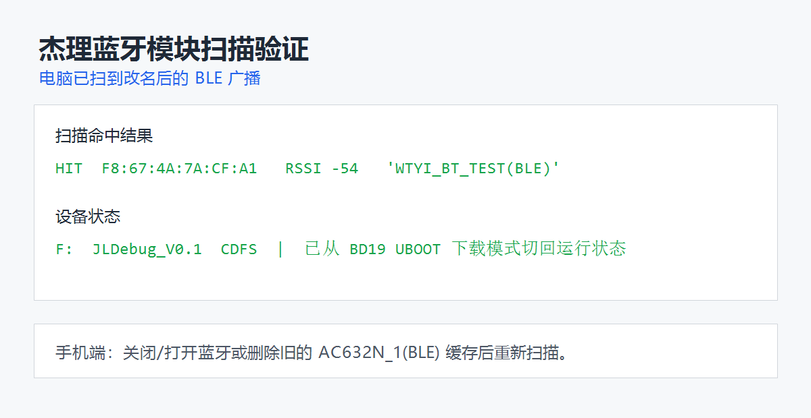

# ac632n-dev-tools

> 杰理 AC6321A / AC632N 蓝牙固件工作区镜像，以及围绕构建、烧录、UART 日志、BLE 验证和板级 bring-up 编写的 Windows 工具链。

| 项目速览 | 内容 |
| --- | --- |
| 核心平台 | JieLi AC6321A4（AC632N / bd19） |
| 开发语言 | C、Python、Windows batch、PowerShell、JavaScript（Node.js ESM） |
| RTOS | FreeRTOS（构建宏 CONFIG_FREE_RTOS_ENABLE）；业务代码通过杰理 SDK OS API / sys_timer_add 使用系统能力 |
| 核心技术 | SPP + BLE、UART 1 Mbps、USB UBOOT、pyserial、tkinter 多线程、bleak、低功耗门控 |
| 我的职责 | 自研脚本、UART CLI/GUI、BLE 扫描器、固件可观测性与动态改名验证、板级测试框架、低功耗门控、日报自动化 |
| 项目状态 | 工作区镜像；工具链和 BLE 动态改名有实机截图/日志，产品板外设寄存器级验证与低功耗电流实测未完成 |

这是一个真实的嵌入式开发工作区：以第三方杰理 SDK 为底座，把固件修改、PC 调试工具、实机日志、构建产物和工程文档放在同一条可追溯链路中，而不是一个从零实现的单体产品仓库。

## 1. 项目简介

该工作区来自深圳维特智能实习期间的杰理 AC6321A / AC632N 蓝牙开发工作。目标应用是 apps/spp_and_le，同时覆盖经典蓝牙 SPP 与 BLE；目标板卡为 AC6321A4，SDK 平台为 bd19。真实开发材料集中在 2026-07-10 至 2026-07-23，仓库中的 9 个主线 commit 是 2026-08-31 分批上传镜像形成的，不代表逐日开发历史。

工作中的主要问题不是“写一个 demo”，而是把闭源厂商工具链上的常见动作做成稳定入口：能构建、能烧录、能确认板子处于 app 模式、能接收 1 Mbps UART 日志、能验证 BLE 名称是否真正进入广播包，并把排查结论沉淀为脚本和文档。

仓库还保留一份 WT9011DCL_BT50_FW 产品固件副本。该副本包含从原理图/BOM 核对出的板级引脚、SPI/IIC/ADC 传输层骨架和基于 REGISTER_LP_TARGET 的低功耗门控。需要明确：QMI8685A 与 QMC5883P 的寄存器表尚未确认，相关测试默认关闭；低功耗框架已编译，但没有实测电流数据。

第三方边界也很明确：sdk/、tools/、CodeBlocks/ 及 SDK 工程副本属于厂商或其他权利方；本页重点讲作者可归属的工具、固件改动、调试证据和工程判断，不把厂商 SDK 内部实现包装成个人成果。

## 2. 项目演示与真实效果

### BLE 改名后的扫描结果

截图记录了设备退出 BD19 UBOOT、进入 app 运行态后，电脑扫描到 WTYI_BT_TEST(BLE)。对应的实机日志还记录了名称每 10 秒在 WTYI_BT_TEST 与 WTYI_BT_TEST_B 间切换，同时广播包长度从 26 变为 28 字节：

~~~text
[00:00:20.367][BLE_TRANS]WTYI dynamic name switch to: WTYI_BT_TEST
[00:00:20.374][BLE_TRANS]trans_adv_data(26)
[00:00:30.367][BLE_TRANS]WTYI dynamic name switch to: WTYI_BT_TEST_B
[00:00:30.374][BLE_TRANS]trans_adv_data(28)
~~~

证据入口：[动态改名日志](logs/ac63_uart_gui_20260717_102150.log)、[UART GUI 截图](screenshots/uart_gui_print_received_foreground_20260716_201439.png)、[烧录成功截图](screenshots/WTYI_BT_TEST_burn_success.png)、[环境检查截图](env_check/screenshots/03_env_check_terminal.png)。

演示材料只证明截图和日志中出现过的现象，不代表 GUI 已完成高流量性能测试，也不代表产品板低功耗电流已经测量。

## 3. 核心功能

| 功能 | 实现方式 |
| --- | --- |
| SPP + BLE 固件构建 | batch 设置 SDK、pi32、mc 工具链路径后执行 make ac632n_spp_and_le，并检查 errorlevel |
| USB UBOOT 烧录 | 独立脚本进入 data_trans 后调用厂商 download.bat；不把 USB-TTL 当下载器 |
| UART 日志采集 | pyserial 默认 1,000,000 baud、read(4096) 批量读取，原始字节追加落盘，显示阶段 errors=replace 容错 |
| UART GUI | tkinter 主线程渲染，daemon 读线程采集，queue.Queue 跨线程传递数据，主线程每 100 ms 排空队列 |
| BLE 扫描验证 | bleak 异步扫描，按 WTYI/JL/AC63/BT_TEST 匹配，找到目标返回 0，否则返回 1 |
| 蓝牙名修改与构建 | PowerShell 校验长度和字符白名单，正则替换 .edr_name，确认替换命中后调用 make |
| 固件可观测性 | [WTYI] 启动信息、5 秒 UART 心跳、ADC/IIC/SPI 自检打印；动态 BLE 名称切换与广播包重建 |
| 产品板测试框架 | 从硬件映射生成 SPI/IIC/ADC 传输层与测试入口；未确认寄存器时显式返回错误，不猜地址 |
| 低功耗门控 | busy bitmask 覆盖 BT/SPI/IIC/ADC/OTA，经 REGISTER_LP_TARGET 把“能否休眠”交给 SDK 判断 |
| 日报自动化 | Node.js ESM 脚本把固定结构日报渲染为 PPT，并保留逐页 PNG/layout QA 产物 |

## 4. 技术栈

| 类型 | 技术 |
| --- | --- |
| MCU / 平台 | AC6321A4、AC632N、bd19、CONFIG_BOARD_AC6321A_DEMO |
| 固件 | C、杰理 fw-AC63_BT_SDK、SPP、BLE GATT Server、ADC、soft IIC、SPI1 |
| RTOS / 中间件 | FreeRTOS 构建配置、杰理 OS API、sys_timer_add、REGISTER_LP_TARGET |
| 构建 / 烧录 | GNU Make 4.1、pi32/clang 工具链、ISD、USB UBOOT、Windows batch、PowerShell |
| PC 调试 | Python 3、pyserial、tkinter、threading、queue、asyncio、bleak |
| 交付 | PyInstaller、Windows exe、日志样本、环境截图 |
| 报告自动化 | Node.js ESM、@oai/artifact-tool |

选择这些技术有很强的环境约束：杰理工具链和下载器以 Windows 为主，因此用 batch 做双击入口、用 PowerShell 处理需要输入校验的源码改名；UART 工具选择 pyserial 是为了快速获得 COM 枚举和跨平台串口 API；GUI 选择 tkinter 是因为标准库即可运行并能用 PyInstaller 交付；BLE 扫描沿用 bleak 的异步接口；固件侧只调用 SDK 已提供的 OS、GATT、外设和低功耗接口，避免在闭源平台上重复造轮子。

## 5. 系统总体架构

~~~mermaid
flowchart TB
    subgraph HW["硬件层"]
        MCU["AC6321A4 / bd19"]
        BUS["PA00 UART0 / USB0 UBOOT / SPI1 / soft IIC / PA1 ADC"]
        DEV["USB-TTL、QMI8685A、QMC5883P、电池分压"]
    end

    subgraph DRV["驱动层"]
        SDKDRV["杰理 SDK 外设驱动 UART / USB / SPI / IIC / ADC"]
        WTYIDRV["WTYI 传输层 spi_imu / iic_mag / adc_battery"]
    end

    subgraph MID["中间件层"]
        RTOS["FreeRTOS + 杰理 OS API"]
        BT["BT Stack / GATT Server / SPP + BLE"]
        PM["Timer / syscfg / REGISTER_LP_TARGET"]
    end

    subgraph SVC["服务层"]
        OBS["启动打印、心跳、硬件自检"]
        NAME["名称配置、广播包重建"]
        GATE["WTYI busy-mask 低功耗门控"]
    end

    subgraph APP["应用层"]
        SPPLE["apps/spp_and_le"]
        PRODUCT["WT9011DCL_BT50_FW"]
    end

    subgraph HOST["PC 工具链"]
        BUILD["batch / PowerShell 构建与烧录入口"]
        UART["pyserial CLI / tkinter GUI"]
        SCAN["bleak BLE 扫描"]
    end

    HW --> DRV --> MID --> SVC --> APP
    BUILD --> APP
    APP -->|"PA00 @ 1 Mbps"| UART
    APP -->|"ADV_IND"| SCAN
~~~

分层边界如下：

- 硬件层只描述已核对的芯片、接口和引脚；PA0 是否在产品 PCB 上可访问仍未确认。
- 驱动层分为厂商驱动与作者新增的产品板传输层。QMI8685A/QMC5883P 的寄存器级读取没有完成，不能描述成完整传感器驱动。
- 中间件层属于杰理 SDK/第三方边界，只说明本工程如何调用，不展开闭源实现。
- 服务层承载可归属的业务 glue：日志、硬件测试、名称刷新和低功耗门控。
- PC 工具通过 UART 文本日志与 BLE 标准广播观察固件，不依赖自造私有调试协议。

## 6. 软件架构

### 6.1 入口与初始化顺序

SDK 镜像中的 app_main() 先完成板级/充电等既有初始化，再打印 [WTYI] 启动信息，注册 5 秒心跳和 5 秒硬件测试 timer，随后进入 SDK 应用流程。产品固件副本则在 app_main() 中先调用 wtyi_board_test_init()，再调用 start_app()；初始化函数依次建立日志、BLE 参数输出、低功耗门控，并按编译开关决定是否初始化 SPI/IIC/ADC 测试。

~~~mermaid
flowchart TD
    RESET["复位 / SDK 启动"] --> MAIN["app_main()"]
    MAIN --> BOARD["既有板级与系统初始化"]
    BOARD --> WTYI["WTYI 启动日志 / wtyi_board_test_init()"]
    WTYI --> LP["wtyi_power_manager_init()"]
    WTYI --> TEST{"SPI / IIC / ADC 测试开关"}
    TEST -->|"默认关闭"| SKIP["打印 disabled / 不访问传感器"]
    TEST -->|"显式开启"| BUSINIT["初始化传输层并置 busy flag"]
    LP --> START["start_app() / SPP + BLE"]
    SKIP --> START
    BUSINIT --> START
    START --> TIMER1["5 s UART 心跳 / 硬件自检 timer"]
    START --> TIMER2["10 s BLE 动态改名 timer"]
~~~

### 6.2 任务、中断与 DMA 边界

作者新增代码没有创建独立 FreeRTOS task，也没有维护自定义中断服务程序或 DMA ring buffer；周期工作通过 SDK sys_timer_add() 回调运行。UART、USB、BLE radio 与外设底层中断/DMA 属厂商 SDK 实现，本仓库的自研工具只能看到 SDK 暴露的 API 与数据，不应把内部调度细节算作个人实现。

~~~mermaid
flowchart LR
    SDKOS["FreeRTOS / 杰理 OS"] --> APP["SPP + BLE 应用上下文"]
    SDKOS --> T5["5 s timer callback heartbeat / hw test"]
    SDKOS --> T10["10 s timer callback dynamic BLE name"]
    IRQ["UART / USB / BLE / 外设中断 厂商 SDK 边界"] --> SDKOS
    APP --> PRINTF["printf 字节流"]
    T5 --> PRINTF
    T10 --> GATT["GATT adv disable / rebuild / enable"]
    PRINTF --> PA00["UART0 PA00"]
~~~

固件数据进入 PC 的方式是 PA00 UART 字节流或 BLE ADV；PC 端 UART 工具用 read(4096) 批量取数后原样写文件，GUI 再通过线程安全队列转交主线程。没有证据表明作者代码直接配置了 UART DMA。

## 7. 核心数据流

### 7.1 构建、烧录与运行验证

~~~mermaid
sequenceDiagram
    actor Dev as 开发者
    participant Bat as batch / PowerShell
    participant Make as make + pi32
    participant UBoot as BD19 USB UBOOT
    participant App as SPP + BLE 固件
    participant Tool as UART / BLE 工具

    Dev->>Bat: 选择构建或改名构建
    Bat->>Make: make ac632n_spp_and_le
    Make-->>Bat: update.ufw / jl_isd.fw 或非零退出码
    Dev->>UBoot: 明确进入下载模式后运行烧录脚本
    UBoot->>App: 写入固件并复位到 app 模式
    App-->>Tool: PA00 日志 + ADV_IND 广播
    Tool-->>Dev: 日志文件、GUI、BLE 匹配退出码
~~~

需要注意：SDK target 可能在 post-build 阶段拉起下载器；增强构建脚本已打印警告，但没有从 Makefile 层彻底切断这一副作用。

### 7.2 UART 日志链路

~~~mermaid
flowchart LR
    P["固件 printf"] -->|"UART0 PA00 1,000,000 baud"| TTL["USB-TTL RXD + 共地"]
    TTL --> COM["Windows COM 口"]
    COM --> READ["pyserial read(4096) timeout=0.2 s"]
    READ --> RAW["二进制追加写 logs/*.log write + flush"]
    READ --> Q["queue.Queue"]
    Q -->|"after(100 ms)"| UI["tkinter Text WTYI / ERROR 高亮"]
~~~

### 7.3 蓝牙名称生效链路

~~~mermaid
flowchart LR
    CFG[".edr_name 默认值"] --> PARSE["cfg_file_parse()"]
    FLASH["syscfg 中的历史名称"] --> PARSE
    PARSE --> FORCE["bt_set_local_name() 强制覆盖"]
    FORCE --> OFF["adv_enable(0)"]
    OFF --> NAME["ble_comm_set_config_name()"]
    NAME --> PACK["trans_adv_config_set() 重建 ADV/RSP"]
    PACK --> ON["adv_enable(1)"]
    ON --> AIR["ADV_IND: Flags 0x06 UUID 0x30AF Complete Local Name"]
~~~

## 8. 核心模块讲解

### 8.1 UART CLI 接收器

- 职责：枚举 COM 口、接收 1 Mbps 字节流、落盘并输出到终端。
- 设计：serial.Serial(..., timeout=0.2) 避免永久阻塞；read(4096) 降低高流量下的调用次数；文件用 ab 保留原始字节，显示才做容错解码。
- 数据与异常：每批 buffer 上限 4096 字节；Ctrl+C 返回 0，SerialException 返回 2；没有自动重连。
- 代码：[serial_log_receiver.py](debug_tools/serial_log_receiver.py)，核心函数 list_serial_ports()、receive()、main()。

### 8.2 UART tkinter GUI

- 职责：把串口选择、波特率、启停、清屏、状态和日志显示做成 Windows GUI。
- 设计：读线程负责串口和文件 I/O，主线程负责 UI；queue.Queue[bytes | str] 是线程边界，after(100, _drain_queue) 是 UI 消费入口。
- 数据与异常：每次仍读取 4096 字节；stop_event 协作停止；当前用宽泛的 except Exception 显示错误，串口句柄跨线程关闭存在理论竞态。
- 代码：[uart_print_gui.py](debug_tools/uart_print_gui.py)，核心类 UartPrintGui，重点看 _reader_loop()、_drain_queue()、stop_reader()。

### 8.3 BLE 扫描器

- 职责：扫描命名设备并判断目标名称是否出现。
- 设计：顺应 bleak 的 asyncio API；优先读取 adv.local_name，再回退系统设备名；按地址去重。
- 数据与异常：seen[address] = (name, rssi, timestamp)；30 秒扫描时间写死；找到目标返回 0，否则 1。
- 代码：[ble_scan_wtyi.py](debug_tools/ble_scan_wtyi.py)，核心函数 main() 与内部回调 cb()。

### 8.4 蓝牙改名构建脚本

- 职责：接收新名称、修改 .edr_name 并重新构建。
- 设计：长度校验、字符白名单、替换命中校验三层 fail-fast；try/finally 保证工作目录还原。
- 数据与异常：允许 1~30 个字母、数字、下划线或连字符；make 非零退出码转换为 PowerShell 异常。
- 代码：[set_bt_name_and_build.ps1](set_bt_name_and_build.ps1)，关键是参数声明、-replace 与 LASTEXITCODE。

### 8.5 固件启动、心跳与硬件自检

- 职责：给固件增加 [WTYI] 可检索日志、5 秒心跳、ADC/IIC/SPI demo 自检。
- 设计：用统一前缀连接固件与 PC GUI；IIC 扫描 0x08~0x77；SPI loopback 发送 55 AA 5A A5。
- 中断/异常：通过 SDK timer 周期调用，不是自定义 ISR；SDK 镜像中的 WTYI_HW_TEST_ENABLE 当前为 1，量产前应关闭或配置化。
- 代码：[app_main.c](sdk/fw-AC63_BT_SDK/apps/spp_and_le/app_main.c)，核心函数 wtyi_uart_heartbeat()、wtyi_hw_test_*()、wtyi_hw_test_init()。

### 8.6 BLE 动态改名

- 职责：未连接时每 10 秒切换名称并刷新广播包。
- 设计：连接存在时跳过；未连接时执行“关广播 → 改本地名 → 生成 BLE 名 → 重建 ADV/RSP → 开广播”。
- 数据：广播 buffer 上限 31 字节；实机日志显示 trans_adv_data(26) 与 (28) 随名称长度变化。
- 代码：[ble_trans.c](sdk/fw-AC63_BT_SDK/apps/spp_and_le/examples/trans_data/ble_trans.c)，核心函数 wtyi_dynamic_ble_name_switch()。

### 8.7 产品板 SPI/IIC/ADC 传输层

- 职责：集中声明 WT9011DCL-BT50 引脚、建立 SPI/IIC 事务与 ADC 多次采样框架。
- 设计：硬件事实来自 BOM、原理图和照片交叉核对；未确认 QMI8685A/QMC5883P 寄存器时返回 *_ERR_UNCONFIRMED_REG，不填猜测地址。
- buffer：SPI/IIC read_regs 接收调用者 buffer；ADC 采 32 次、两端各裁 4 个样本后求平均，再按 3M/1M 分压换算。
- 状态：wtyi_config.h 中 SPI/IIC/ADC 测试默认均为 0；当前只能描述为传输层与测试框架，不能声称传感器原始数据已读通。
- 代码：[wtyi_spi_imu.c](work/WT9011DCL_BT50_FW/apps/spp_and_le/wtyi/wtyi_spi_imu.c)、[wtyi_iic_mag.c](work/WT9011DCL_BT50_FW/apps/spp_and_le/wtyi/wtyi_iic_mag.c)、[wtyi_adc_battery.c](work/WT9011DCL_BT50_FW/apps/spp_and_le/wtyi/wtyi_adc_battery.c)、[wtyi_config.h](work/WT9011DCL_BT50_FW/apps/spp_and_le/wtyi/wtyi_config.h)。

### 8.8 低功耗门控

- 职责：向 SDK 回答 WTYI 板级工作是否空闲，不主动 poweroff，也不改唤醒脚或 BLE 参数。
- 设计：volatile u32 bitmask 表示 BT/SPI/IIC/ADC/OTA busy；任一 bit 置位时 is_idle() 返回 0，全部清零才允许 SDK 综合其他 target 决定是否休眠。
- 异常/边界：busy mask 的读改写没有显式临界区；BT busy API 尚未接入正常连接流程；OTA 已在 update 流程中同步。
- 代码：[wtyi_power_manager.c](work/WT9011DCL_BT50_FW/apps/spp_and_le/wtyi/wtyi_power_manager.c)、[low_power_design.md](work/WT9011DCL_BT50_FW/project_docs/low_power_design.md)。

### 8.9 日报 PPT 自动化

- 职责：把固定结构日报转换为 10 页 PPT，并输出逐页 PNG/layout 供检查。
- 设计：以 addText/addBox/addRule/bulletList/metric/card 等布局原语复用版式；Node.js 工具层包含输出路径边界检查。
- 边界：主脚本仍有硬编码输出路径，不是通用 SaaS 或在线服务。
- 代码：[build_daily_report_deck.mjs](ppt_work/daily_report_summary/tmp/build_daily_report_deck.mjs)、[QA contact sheet](ppt_work/daily_report_summary/tmp/qa/contact_sheet.png)。

## 9. 核心代码导航

| 文件 | 作用 | 推荐程度 |
| --- | --- | --- |
| [README_AC6321A_WORKFLOW.txt](README_AC6321A_WORKFLOW.txt) | 7 步本地开发闭环与硬件注意事项 | ★★★★★ |
| [uart_print_gui.py](debug_tools/uart_print_gui.py) | tkinter 生产者/消费者模型与串口 GUI | ★★★★★ |
| [serial_log_receiver.py](debug_tools/serial_log_receiver.py) | 1 Mbps 原始日志落盘、退出码与参数化 | ★★★★★ |
| [ble_scan_wtyi.py](debug_tools/ble_scan_wtyi.py) | asyncio BLE 扫描与脚本化验证 | ★★★★☆ |
| [set_bt_name_and_build.ps1](set_bt_name_and_build.ps1) | 输入校验、源码替换、构建失败处理 | ★★★★★ |
| [app_main.c](sdk/fw-AC63_BT_SDK/apps/spp_and_le/app_main.c) | WTYI 启动日志、心跳与 demo 硬件自检 | ★★★★☆ |
| [ble_trans.c](sdk/fw-AC63_BT_SDK/apps/spp_and_le/examples/trans_data/ble_trans.c) | 动态改名与 BLE 广播包重建 | ★★★★★ |
| [user_cfg.c](sdk/fw-AC63_BT_SDK/apps/spp_and_le/modules/user_cfg.c) | .edr_name 与配置区旧名覆盖根因 | ★★★★★ |
| [wtyi_power_manager.c](work/WT9011DCL_BT50_FW/apps/spp_and_le/wtyi/wtyi_power_manager.c) | busy-mask + REGISTER_LP_TARGET | ★★★★★ |
| [hardware_map.md](work/WT9011DCL_BT50_FW/project_docs/hardware_map.md) | MCU/器件/引脚的证据化核对 | ★★★★☆ |

调用关系可以压缩成三条：

1. app_main() → start_app() → SPP/BLE 运行；作者新增 timer 旁路输出心跳和触发动态改名。
2. wtyi_board_test_init() → wtyi_power_manager_init() → 按开关初始化 SPI/IIC/ADC；默认传感器测试关闭。
3. set_bt_name_and_build.ps1 → 修改 user_cfg.c → make；运行时 cfg_file_parse() 再处理 syscfg 历史名称，BLE 侧重建广播包。

## 10. 关键技术实现

### 10.1 解决“源码改名但设备仍显示旧名”

- 问题：.edr_name 是默认值，flash/syscfg 里的历史名称会在启动解析时覆盖它。
- 方案：SDK demo 在 cfg_file_parse() 读配置后调用 bt_set_local_name() 强制覆盖；产品固件进一步把产品名写回配置区。
- 关键实现：默认值、运行时本地名和 BLE ADV 名分层处理；动态变更时显式重建 ADV/RSP。
- 优点：把“代码配置”与“持久化配置”的优先级问题变成可观察、可复现的流程。
- 潜在问题：SDK demo 中 WTYI_BT_TEST 重复硬编码；PowerShell 修改默认值不等于修改所有运行时来源。
- 代码：[user_cfg.c](sdk/fw-AC63_BT_SDK/apps/spp_and_le/modules/user_cfg.c)、[ble_trans.c](sdk/fw-AC63_BT_SDK/apps/spp_and_le/examples/trans_data/ble_trans.c)。

### 10.2 1 Mbps UART 的保真落盘与 GUI 解耦

- 问题：高波特率日志可能被任意分块，直接按文本处理容易遇到非法 UTF-8；GUI 线程也不能阻塞读串口。
- 方案：串口线程批量读 bytes，原始字节立即写文件；GUI 用队列跨线程传递，主线程定时批量渲染。
- 关键实现：read(4096)、二进制追加、flush()、errors=replace、queue.Queue、after(100)。
- 优点：文件保真、显示容错、线程职责清楚。
- 潜在问题：没有按行重组；GUI 无环形缓冲；断线不自动重连。
- 代码：[serial_log_receiver.py](debug_tools/serial_log_receiver.py)、[uart_print_gui.py](debug_tools/uart_print_gui.py)。

### 10.3 用日志证明 BLE 广播包确实刷新

- 问题：系统蓝牙缓存会让“名称是否生效”看起来不确定，只看手机 UI 不足以定位。
- 方案：固件打印名称切换、生成后的 BLE 名和 ADV hex；PC 扫描器再从空中广播读取 local_name。
- 关键实现：ADV 中包含 Flags 0x06、16-bit UUID 0x30AF、Complete Local Name；名称变长时包长度同步变化。
- 优点：固件内部证据与外部扫描结果互相印证。
- 潜在问题：扫描器仍受系统缓存、无线环境与固定 30 秒窗口影响。
- 代码：[ble_trans.c](sdk/fw-AC63_BT_SDK/apps/spp_and_le/examples/trans_data/ble_trans.c)、[ble_scan_wtyi.py](debug_tools/ble_scan_wtyi.py)、[实机日志](logs/ac63_uart_gui_20260717_102150.log)。

### 10.4 低功耗采用“门控”而不是强制休眠

- 问题：SPI/IIC/ADC/OTA 工作中进入低功耗会破坏事务，但业务层不应绕开 SDK 直接 poweroff。
- 方案：将忙闲状态压成 bitmask，注册为一个 SDK low-power target；只有 WTYI 与其他 target 都 idle 时，SDK 才可能休眠。
- 关键实现：wtyi_power_set_busy()、wtyi_power_idle_query()、REGISTER_LP_TARGET(wtyi_lp_target)。
- 优点：改动集中、易回退，与 SDK 的全局电源策略保持边界。
- 潜在问题：未测电流；BT busy 未接入；bitmask 并发更新缺少显式临界区。
- 代码：[wtyi_power_manager.c](work/WT9011DCL_BT50_FW/apps/spp_and_le/wtyi/wtyi_power_manager.c)、[low_power_design.md](work/WT9011DCL_BT50_FW/project_docs/low_power_design.md)。

### 10.5 未确认器件寄存器时主动停在传输层

- 问题：需求文档写 QMI8658A/QMC5883，而 BOM 指向 QMI8685A/QMC5883P，CAD LibRef 又复用了 BMI160/IST8308，直接套寄存器会产生假驱动。
- 方案：先确认引脚和总线事务；寄存器级 ID/raw 读取返回 *_ERR_UNCONFIRMED_REG，默认关闭传感器测试。
- 关键实现：显式错误码、编译开关和硬件事实清单。
- 优点：避免“能编译但读错器件”的危险假成功。
- 潜在问题：产品传感器功能尚未闭环，需要可靠 datasheet 与实机验证。
- 代码：[hardware_map.md](work/WT9011DCL_BT50_FW/project_docs/hardware_map.md)、[wtyi_spi_imu.c](work/WT9011DCL_BT50_FW/apps/spp_and_le/wtyi/wtyi_spi_imu.c)、[wtyi_iic_mag.c](work/WT9011DCL_BT50_FW/apps/spp_and_le/wtyi/wtyi_iic_mag.c)。

## 11. 技术难点

1. 厂商 Windows 工具链有固定目录、闭源下载器和 post-build 副作用，构建、烧录与板卡状态必须分开理解。
2. 蓝牙名称同时受源码默认值、syscfg 持久值、经典蓝牙本地名、BLE 广播名和系统缓存影响，不能只改一行判断结果。
3. 1 Mbps UART 对 USB-TTL、接线、共地、读取吞吐和显示性能都更敏感，文件保真与界面可读性要分层处理。
4. 产品板硬件资料存在需求名、BOM 名与 CAD LibRef 不一致，必须先核对器件身份，再选择寄存器表。
5. 低功耗改动需要尊重 SDK 已有的全局仲裁：业务层只提供 busy/idle 事实，不能把“允许睡”误写成“立即睡”。

## 12. 问题与解决方案

| 现象 | 初步判断 / 排查 | 根因 | 解决与验证 | 结果 |
| --- | --- | --- | --- | --- |
| 改 .edr_name 后仍显示旧名 | 比较源码、启动日志与 cfg_file_parse() | syscfg 历史名称覆盖默认值 | 读配置后强制 bt_set_local_name()；产品版写回 syscfg；扫描与日志交叉验证 | 已定位并在现有固件路径中处理 |
| 烧录后扫不到 BLE | 检查设备枚举和运行态 | 板卡仍在 BD19 UBOOT，不运行 app | 复位到 JLDebug_V0.1 / app 模式后重新扫描 | 截图已扫到 WTYI_BT_TEST(BLE) |
| 插 Type-C 收不到 UART 日志 | 对照原理图与接线文档 | Type-C 用于 USB0 下载，不是 PA00 UART | PA00/TX 接 USB-TTL RXD 并共地；产品板 PA0 测试点仍未确认 | demo 链路有日志；产品板可接入性未确认 |
| 日志出现 IPP/PIPP 等碎片 | 检查原始日志、波特率、分块与解码方式 | ⚠️ 工程风险分析：高波特率、多源 printf、字节分块或链路误码都可能导致；没有唯一根因证据 | 原始 bytes 落盘、显示容错；后续应加行缓冲并做示波/不同 USB-TTL 对照 | 已避免显示崩溃，碎片根因未闭环 |
| 串口拔出后工具停止 | 对照 requirements 与异常路径 | 需求要求自动重连，但现有 CLI/GUI 未实现 | ⚠️ 工程风险分析：增加状态机、退避重试和端口重发现 | 未实现，明确列为 gap |
| GUI 长时间高流量可能卡顿 | 检查 tk.Text 全量追加与 20 MB 日志样本 | ⚠️ 工程风险分析：无显示上限、持续 insert/see 会增加渲染与内存压力，未做基准测试 | 后续采用环形缓冲、批量插入、暂停跟随和渲染节流 | 未实测，不声称性能指标 |

## 13. 工程优化

### 已实现

- 构建增强脚本检查 make 退出码并打印固件产物位置。
- 改名脚本对输入做长度、白名单、替换命中和构建退出码校验。
- UART CLI 将原始落盘与文本显示分离，异常使用不同退出码。
- GUI 用队列隔离串口线程与 tkinter 主线程，并提供协作式停止。
- BLE 扫描器以退出码表达“找到/未找到”，可被上层脚本消费。
- 产品板用集中配置头文件管理引脚、功能开关和 BLE 参数档。
- 低功耗模块提供单一回退开关，并在 OTA / 外设操作期间维护 busy 状态。
- 硬件文档明确记录器件身份冲突、未确认项和“不声称实测电流”的边界。

### 如果重做

1. 用脚本自身目录、环境变量或配置文件替代 <workspace> 硬编码，并让 PyInstaller spec 使用相对入口。
2. 把 UART 接收抽成“端口发现 → 连接 → 读取 → 退避重连”的显式状态机，CLI 与 GUI 复用同一接收核心。
3. 增加 bytes 行缓冲和 GUI 环形显示 buffer，分开“全量落盘”与“最近 N 行展示”。
4. 从构建系统层彻底拆分 build-only 与 flash target；烧录同时检查退出码和可靠完成标志。
5. 获取可靠的 QMI8685A/QMC5883P 寄存器资料后，再实现 ID、原始数据与错误恢复，并以逻辑分析仪/实机日志验证。
6. 给低功耗 busy mask 加原子操作或临界区，接入 BT 活动状态后执行电流、唤醒和 OTA 回归测试。

## 14. 项目目录结构

~~~text
.
├─ 01~07_*.bat / build_ac632n_spp_and_le.bat  # 打开、构建、烧录、串口、改名入口
├─ set_bt_name_and_build.ps1                  # 校验名称、修改源码并构建
├─ README_AC6321A_WORKFLOW.txt                # 本地开发流程总纲
├─ debug_tools/                               # UART CLI/GUI、BLE 扫描、接线文档、原理图
├─ python_tools/                              # 早期 UART logger
├─ build_uart_gui/ + dist/                    # PyInstaller spec 与 Windows exe
├─ env_check/                                 # 环境检查脚本和截图
├─ logs/                                      # 实机 UART 日志样本
├─ screenshots/                               # BLE、烧录、GUI 证据截图
├─ ppt_work/                                  # 日报 PPT 自动化及 QA 产物
├─ sdk/fw-AC63_BT_SDK/                        # 第三方杰理 SDK 镜像 + 6 个固件源文件改动
├─ work/WT9011DCL_BT50_FW/                    # 产品固件副本、WTYI 模块与设计文档
├─ tools/ + CodeBlocks/ + python_pkgs/        # 第三方/本地依赖镜像
└─ docs/interview/                            # 15 篇深度技术文档
~~~

work/gitee_fw-AC63_BT_SDK_clean/ 与 work/gitee_fw-AC63_BT_SDK_official_burn/ 是 SDK 工程副本；work/gitee_fw-AC63_BT_SDK/ 在原 README 中标记为空检出，不作为功能模块介绍。

## 15. 👨‍💻 我的主要工作

以下归属依据任务提供的证据边界、源码中的 WTYI 改动和仓库内产物整理：

- 编写根目录构建/烧录/串口/改名脚本，以及带三层参数校验的 PowerShell 改名构建流程。
- 编写 jieli_uart_logger.py、serial_log_receiver.py、uart_print_gui.py 与 ble_scan_wtyi.py，并将 GUI 打包为 Windows exe。
- 在厂商 SDK 的 SPP+LE 示例上增加 [WTYI] 启动打印、5 秒 UART 心跳、ADC/IIC/SPI demo 自检和 BLE 动态改名验证。
- 排查“配置区旧名覆盖源码默认值”的根因，并形成强制覆盖、产品版持久化和广播包重建的完整解释链。
- 设计产品板 wtyi/ 测试框架、集中配置、日志宏、SPI/IIC/ADC 传输层与硬件映射文档；对未确认寄存器主动停止实现。
- 实现低功耗 busy-mask 门控框架及 OTA/外设 busy 接入，编写可回退设计文档；没有把未测电流写成成果。
- 编写钉钉日报 PPT 自动化脚本并保留 QA 预览产物。

厂商 SDK、CodeBlocks、下载工具、编译工具链及其内部 BT/RTOS/驱动实现不属于个人自研成果，只描述使用边界。original_git_status.txt 中除了 6 个固件源文件，还包含生成物、配置工具输出和缺失二进制；因此“6 个文件”只用于描述可审阅的固件源文件改动，不代表整个 SDK 只有 6 条状态变化。

## 16. 项目亮点

1. 用“原始字节落盘 + 显示容错 + GUI 队列”把 1 Mbps UART 的采集正确性和界面线程安全分开处理。
2. 从 syscfg 覆盖链定位蓝牙名不生效根因，并用 ADV hex 长度变化证明运行时广播包确实重建。
3. 构建、烧录、app 运行态、UART 与 BLE 扫描形成可点击、可留痕的 Windows 调试闭环。
4. 面对 BOM、需求和 CAD LibRef 冲突时，以显式 UNCONFIRMED_REG 错误停止错误实现，而不是套用相似器件寄存器。
5. 低功耗只提供 busy/idle 门控并交还 SDK 仲裁，保留一键回退和“未实测电流”的工程边界。
6. 把实习中的工具、固件 diff、日志、截图、设计文档和报告自动化统一放进可追溯工作区。

## 17. 🎯 项目能力映射

| 能力 | 项目中的体现 |
| --- | --- |
| 嵌入式 C | 在 SPP+LE app 中增加 timer、日志、硬件测试与 BLE 广播刷新；产品副本中组织板级模块 |
| RTOS / 并发 | 使用 FreeRTOS 构建环境和 SDK timer；PC GUI 用线程安全队列隔离 I/O 与 UI |
| UART / 调试 | 1 Mbps 接线、原始日志落盘、异常退出码、GUI 高亮和真实日志分析 |
| BLE | 区分经典名与 BLE 广播名，解析 ADV AD structure，处理动态改名与扫描验证 |
| 硬件 bring-up | 从原理图/BOM/照片核对 MCU、总线、器件和引脚冲突，并保留未确认边界 |
| 低功耗 | REGISTER_LP_TARGET、busy bitmask、OTA/外设门控、回退设计与待测清单 |
| 工程自动化 | batch、PowerShell、Python、PyInstaller、Node.js 覆盖开发到交付 |
| 问题定位 | 配置区旧名、UBOOT/app 状态、Type-C/UART 通道、高波特率碎片等证据链 |
| 工程诚信 | 不宣称传感器寄存器已跑通，不编电流与 GUI 性能数据，明确第三方边界 |

## 18. 🗣️ 项目设计总结

### 项目摘要

> 这是我在深圳维特智能实习期间维护的杰理 AC6321A 蓝牙开发工作区镜像。固件侧我在 SPP+BLE 示例上加了 UART 心跳、硬件自检和 BLE 动态改名；PC 侧用 Python 做了 1 Mbps 串口 CLI、tkinter GUI 和 BLE 扫描器，并打包成 Windows exe。最有代表性的排查是配置区旧名覆盖源码默认值，我从 syscfg 路径定位根因，再通过重建广播包和实机日志验证名称确实变化。产品固件里还做了低功耗门控框架，但电流没有实测，我不会给出虚假指标。

### 核心设计说明

> 这个仓库不是单一产品，而是“厂商 SDK + 自研工具链 + 一份产品固件副本”。目标芯片是 AC6321A4，平台 bd19，应用跑 SPP+BLE。开发流程在 Windows 上，我把打开工程、构建、USB UBOOT 烧录、串口枚举、日志接收和改蓝牙名都做成了脚本。
>
> 工具里我最想讲 UART GUI：读线程用 pyserial 每次取 4096 字节，原始 bytes 直接落盘，再放进 queue.Queue；tkinter 主线程每 100 ms 消费，因为 UI 不能跨线程更新。BLE 这边我解决了配置区旧名覆盖 .edr_name 的问题，运行时动态改名会先关广播、更新名称、重建 ADV/RSP，再打开广播。日志中广播包从 26 变 28 字节，可以证明不是只改了界面缓存。
>
> 产品板部分我核对了 SPI/IIC/ADC 引脚并写了低功耗 busy-mask 门控。QMI8685A/QMC5883P 寄存器和低功耗电流还没实测，所以 README 明确停在传输层与框架状态。

### 完整技术说明

> 我会从两条链讲这个项目。第一条是开发闭环：batch 设置 <sdk_path>\pi32、<sdk_path>\mc 和 SDK make 路径，构建 ac632n_spp_and_le，USB UBOOT 负责烧录，复位回 app 模式后再通过 PA00 UART 和 BLE 扫描验证。这里最容易混的是 Type-C 只负责 USB 下载，UART 日志要 PA00 接 USB-TTL；板子停在 UBOOT 时既没有正常 app 日志，也扫不到 BLE。
>
> 第二条是可观测性。固件加了 [WTYI] 启动打印和 5 秒心跳，PC 工具默认 1 Mbps。CLI 将原始字节追加到日志，显示才用 errors=replace；GUI 用读线程生产、主线程消费的队列模型。这样即便显示遇到非法 UTF-8，文件仍保留原始数据。当前缺点是没有自动重连，GUI 也没有高流量基准和环形缓冲。
>
> 蓝牙名排查体现了我读 SDK 的方式：先看 .edr_name，再沿 cfg_file_parse() 发现 syscfg 旧值会覆盖默认值，所以在读取后强制设置；产品版进一步写回配置区。动态改名不能只改字符串，还要关广播、调用 ble_comm_set_config_name()、重建 adv/rsp、重新广播。实机日志显示名称和广播包长度同步变化，外部扫描也能命中。
>
> 产品固件里，我从 BOM、原理图和照片核对出 AC6321A4、QMI8685A、QMC5883P、PA1 电池 ADC 等信息。由于器件命名与 CAD LibRef 有冲突，我没有猜寄存器，只完成总线事务和错误边界。低功耗用 REGISTER_LP_TARGET 接入 busy mask，让 SPI/IIC/ADC/OTA 忙时阻止休眠；框架编译通过，但没有电流实测。这个项目最能说明的是：我能把现场问题从现象追到机制，再固化成工具、日志和可回退设计，同时清楚标出没完成的部分。

## 19. 设计思考与 FAQ

### 1. 为什么 UART 文件用二进制追加，不是文本追加？

高波特率读取可能从任意字节边界切开，多字节文本也可能不完整。原始 bytes 先落盘能保真，显示阶段再容错解码；后续仍可重新按其他编码或 hex 分析。

### 2. timeout=0.2 与 read(4096) 分别控制什么？

timeout 是一次读最多等待 0.2 秒，不是波特率；4096 是本次最多取出的字节数。批量读取减少调用频率，但不保证得到完整“行”或完整“包”。

### 3. 串口格式是不是 8N1？

脚本没有显式传 bytesize/parity/stopbits，因此实际依赖 pyserial 默认值。按库默认是 8N1，但仓库没有把它写成显式契约，【待本人确认】固件端设置后再补成双方都可验证的参数。

### 4. tkinter 为什么要线程加队列？

串口 read() 会阻塞，不能占用 UI 主线程；tkinter 又不支持读线程直接操作控件。因此读线程只产出 bytes，queue.Queue 负责同步，主线程用 after() 消费并更新界面。

### 5. 改 .edr_name 为什么不一定生效？

它只是源码默认值。启动时 syscfg_read(CFG_BT_NAME) 可能读出 flash 中的旧值并覆盖默认值，所以必须明确处理持久化配置的优先级。

### 6. 运行时修改 BLE 名称为什么要重建广播包？

扫描端看到的是已编码到 ADV/RSP 中的 AD structure，不会自动跟随某个 C 字符串变化。必须停广播、更新本地/BLE 配置名、重建包，再重新广播。

### 7. 日志里的 02 01 06 03 03 30 AF 怎么解释？

02 01 06 是 Flags，03 03 30 AF 是完整 16-bit UUID 列表中的 0x30AF（小端字节序），后续 09 类型是 Complete Local Name。整个 legacy advertising data 上限是 31 字节。

### 8. 为什么烧录后可能扫不到 BLE？

BD19 UBOOT 是下载引导态，不运行 SPP+BLE app。需要烧录结束后复位到 app 模式，再排除手机/Windows 蓝牙缓存后扫描。

### 9. 低功耗为什么用 busy mask？

多个模块只需要表达忙闲事实，bitmask 能把 BT/SPI/IIC/ADC/OTA 收敛到统一接口。is_idle() 不直接休眠，只参与 SDK 对所有 low-power target 的综合判断，边界更安全。

### 10. 低功耗做到了什么，没做到什么？

做到了可编译、可回退的门控框架，以及 SPI/IIC/ADC/OTA busy 接入；没有改变 poweroff、唤醒脚和 BLE 参数，也没有实测电流。BT busy 仍是预留 API。

### 11. 为什么 QMI8685A/QMC5883P 没有直接读 ID？

需求、BOM 和 CAD LibRef 信息冲突，仓库里没有可靠寄存器资料。直接复用 QMI8658A、BMI160 或 IST8308 的地址可能编译通过但读错设备，所以代码显式返回未确认错误。

### 12. 这个工程最先应该改什么？

先补 UART 自动重连与行缓冲，因为它直接影响调试连续性和数据解释；随后去掉绝对路径、限制 GUI 显示 buffer，再从构建系统层彻底分离 build 与 flash。

详细问答与深入分析见下一节的 10_INTERVIEW_QA.md。

## 20. 📎 深入阅读

详细技术文档与源码同仓库维护，入口如下：

| 文档 | 内容 |
| --- | --- |
| [00_PROJECT_OVERVIEW.md](docs/interview/00_PROJECT_OVERVIEW.md) | 项目定位、证据与成果边界 |
| [01_TECH_STACK.md](docs/interview/01_TECH_STACK.md) | 技术栈与追问方向 |
| [02_SYSTEM_ARCHITECTURE.md](docs/interview/02_SYSTEM_ARCHITECTURE.md) | 架构和数据流 |
| [03_CODE_WALKTHROUGH.md](docs/interview/03_CODE_WALKTHROUGH.md) | 文件级代码走读 |
| [04_CORE_MODULES.md](docs/interview/04_CORE_MODULES.md) | 核心模块拆解 |
| [05_PROTOCOLS_AND_DATAFLOW.md](docs/interview/05_PROTOCOLS_AND_DATAFLOW.md) | UART/BLE 协议与数据流 |
| [06_CONCURRENCY_AND_EXCEPTIONS.md](docs/interview/06_CONCURRENCY_AND_EXCEPTIONS.md) | 并发和异常处理 |
| [07_HARDWARE_INTERACTION.md](docs/interview/07_HARDWARE_INTERACTION.md) | 硬件链路和烧录 |
| [08_DEBUG_AND_PROBLEMS.md](docs/interview/08_DEBUG_AND_PROBLEMS.md) | 真实问题与排查 |
| [09_OPTIMIZATION.md](docs/interview/09_OPTIMIZATION.md) | 现状与优化方向 |
| [10_INTERVIEW_QA.md](docs/interview/10_INTERVIEW_QA.md) | 详细技术文档 |
| [11_INTERVIEW_SCRIPT.md](docs/interview/11_INTERVIEW_SCRIPT.md) | 多时长讲解稿 |
| [12_CODE_NAVIGATION.md](docs/interview/12_CODE_NAVIGATION.md) | 5 分钟 GitHub 演示路线 |
| [13_CODE_REVIEW.md](docs/interview/13_CODE_REVIEW.md) | 代码质量审计 |
| [14_DEVELOPMENT_HISTORY.md](docs/interview/14_DEVELOPMENT_HISTORY.md) | 开发与镜像上传历史 |

## 开发者使用信息

### 硬件与环境

- 主控/平台：AC6321A4 / bd19。
- 当前 board：CONFIG_BOARD_AC6321A_DEMO。
- UART 日志：UART0 TX = PA00，默认 1,000,000 baud；PA00/TX → USB-TTL RXD，GND 共地。
- 不要把 USB-TTL 5V/VCC 接到板 IO；板由 USB-C 供电时不要再接 USB-TTL VCC。
- USB-C / USB0 用于 UBOOT 下载，不是普通 UART 日志口。
- 编译链：<sdk_path>\pi32、<sdk_path>\mc。
- SDK：<workspace>\sdk\fw-AC63_BT_SDK。

环境检查：双击 [show_env_check.bat](env_check/show_env_check.bat)，查看 CodeBlocks、clang、make、下载器、Python 与 COM 口。

### 构建

~~~bat
02_build_ac6321a_spp_and_le.bat
~~~

或使用精简脚本：

~~~bat
build_ac632n_spp_and_le.bat
~~~

预期产物：

~~~text
sdk\fw-AC63_BT_SDK\cpu\bd19\tools\download\data_trans\update.ufw
sdk\fw-AC63_BT_SDK\cpu\bd19\tools\download\data_trans\jl_isd.fw
~~~

注意：该 SDK target 的 post-build 可能拉起下载器；板卡处于 BD19 UBOOT 时存在顺带烧录的可能。需要严格 build-only 时，应使用产品固件下已有的 [build_only.bat](work/WT9011DCL_BT50_FW/tools/wtyi/build_only.bat)。

### 烧录

1. 明确让板卡进入 BD19 UBOOT 模式。
2. 双击 [03_burn_ac6321a_usb_uboot.bat](03_burn_ac6321a_usb_uboot.bat)，或用 [04_open_isd_download_gui.bat](04_open_isd_download_gui.bat) 打开 ISD GUI。
3. 当前脚本没有可靠的自动成功判定，需检查厂商输出中的完成信息。
4. 烧录后复位回 app 模式，再验证 UART/BLE。

### UART 日志

列出串口：

~~~bat
05_list_serial_ports.bat
~~~

交互式接收：

~~~bat
06_receive_uart_log_COMx.bat
~~~

直接调用 API/CLI：

~~~powershell
python debug_tools\serial_log_receiver.py --list
python debug_tools\serial_log_receiver.py -p COMx -b 1000000
python debug_tools\uart_print_gui.py --no-auto
~~~

日志默认写入 logs/。详细接线见 [README_UART_LOG.md](debug_tools/README_UART_LOG.md) 与 [UART_DEBUG_README.txt](debug_tools/UART_DEBUG_README.txt)。

### BLE 扫描与改名

~~~powershell
python debug_tools\ble_scan_wtyi.py
powershell -File set_bt_name_and_build.ps1 -Name MY_JL_BT
~~~

也可以双击 [07_set_bt_name_build.bat](07_set_bt_name_build.bat)。名称只允许 1~30 个字母、数字、下划线或连字符。改名脚本会修改 SDK 源码并构建；执行前应确认这正是期望的工作副本。

### Windows GUI 交付物

- PyInstaller 配置：[JieLi_UART_Print_Receiver.spec](build_uart_gui/JieLi_UART_Print_Receiver.spec)
- 已有产物：[JieLi_UART_Print_Receiver.exe](dist/JieLi_UART_Print_Receiver.exe)

【待本人确认】现有 exe 是否在所有目标 Windows 机器上完成过无 Python 环境回归；spec 的 hiddenimports 为空，仓库只能证明产物存在和已有截图，不能证明全环境兼容。

## 说明、License 与免责声明

- 本仓库是个人开发工作区备份，不是单一量产产品的完整发布包。
- 杰理 SDK、固件工程副本、CodeBlocks、编译/下载工具、Python 依赖包等第三方内容版权与许可归各自权利方所有，仅按各自授权用于学习、开发和备份。
- 仓库当前没有单独的根目录 LICENSE 文件；不要据此推定第三方内容可再分发或商用。
- 个别 tone 工具二进制曾因本地杀毒软件隔离而缺失，可在有合法来源和授权的前提下从原始环境恢复。
- debug_tools/schematic/ 等可能涉及公司产品资料，公开、复制或对外演示前需自行确认授权。
- 低功耗电流、GUI 高流量性能、产品板 PA0 可访问性、QMI8685A/QMC5883P 寄存器级读数均没有充分实测证据，本页不提供相关数值或完成性承诺。
