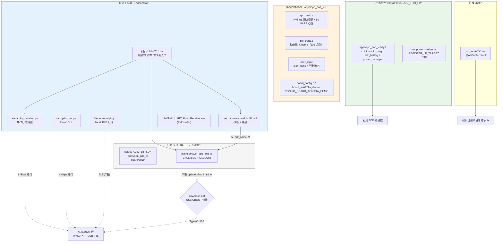
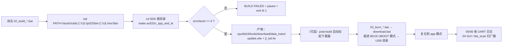
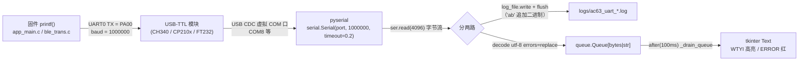
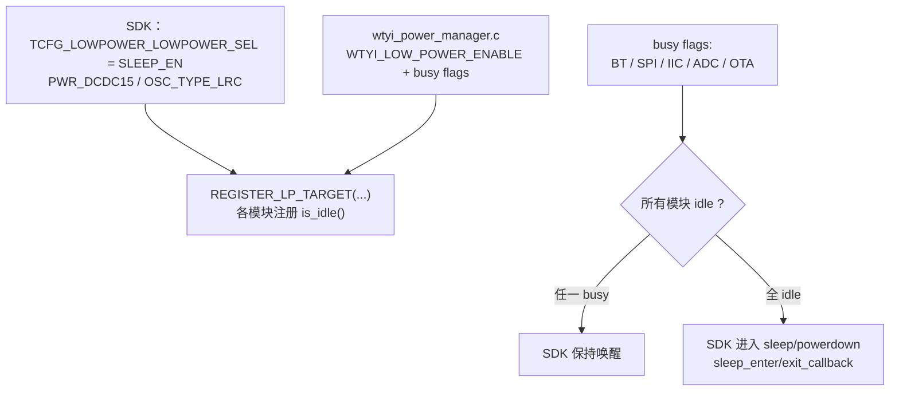

# 02 · 系统架构（System Architecture）

> 本工作区不是单体程序，而是"厂商 SDK + 自研工具集"的异构集合。下面按"模块关系"和"数据流"两条线讲清楚，Mermaid 图按真实代码绘制。

---

## 1. 工作区全景（模块关系）



**要点**：
- `sdk/`、`tools/`、`CodeBlocks/`、`python_pkgs/` 是**第三方/依赖**，`debug_tools/`、`python_tools/`、`build_uart_gui/`、`dist/`、`env_check/`、`ppt_work/`、根脚本是**自研/组装**。
- `work/WT9011DCL_BT50_FW` 是**真实产品固件**（含独立 `.git`），`work/gitee_fw-*` 是 SDK 的干净/烧录版副本，`work/gitee_fw-AC63_BT_SDK` 为空检出（`.gitignore` 明确排除）。

---

## 2. 构建 → 烧录 → 调试 闭环



**关键证据**：
- 构建命令与 PATH：`build_ac632n_spp_and_le.bat:3-6`。
- 失败判断：`02_build_ac6321a_spp_and_le.bat:10-15`。
- post-build 自动烧录风险：`README_AC6321A_WORKFLOW.txt:21-23`。
- 烧录命令：`03_burn_ac6321a_usb_uboot.bat:3-5`（`call download.bat`）。
- 日志/扫描闭环：`05_list_serial_ports.bat`、`06_receive_uart_log_COMx.bat`、`debug_tools/ble_scan_wtyi.py`。

---

## 3. UART 日志链路（核心数据流）



**证据**：
- 固件侧：`app_main.c:126` `printf("[WTYI] UART heartbeat %lu, ...\r\n", ++cnt)`，`sys_timer_add(NULL, wtyi_uart_heartbeat, 5000)`（第 237 行）。
- 接线/波特率：`README_UART_LOG.md:5-17`、`serial_log_receiver.py:23` `DEFAULT_BAUD = 1_000_000`。
- 接收实现：`serial_log_receiver.py:56-72`（`serial.Serial` + `log_path.open("ab")`）。
- GUI 队列：`uart_print_gui.py:39` `self.rx_queue`、`145-147` 读线程、`175-191` `_drain_queue`。

---

## 4. 蓝牙名修改链路（名字是怎么生效的）

```mermaid
flowchart TB
    CODE[".edr_name = \"WTYI_BT_TEST\"<br/>user_cfg.c BT_CONFIG bt_cfg"] --> PARSE["cfg_file_parse()"]
    PARSE --> READ["syscfg_read(CFG_BT_NAME, ...) 读配置区旧名"]
    READ --> FORCE["bt_set_local_name(\"WTYI_BT_TEST\", ...)<br/>强制覆盖（解决旧名覆盖）"]
    FORCE --> GET["bt_get_local_name() 返回 edr_name"]
    GET --> BLE["ble_comm_set_config_name(name, add_ble_ext_name)<br/>经典名 + '(BLE)' 后缀"]
    BLE --> ADV["trans_adv_config_set() 重建 adv/rsp 广播包"]
    ADV --> ON["ble_gatt_server_adv_enable(1) 重新广播"]
    ON --> SCAN["电脑/手机 BLE 扫描可见"]

    style FORCE fill:#fff3e0,stroke:#fb8c00
```

**证据**：
- `.edr_name`：`user_cfg.c:44`。
- 强制改名：`user_cfg.c:217-218`（`bt_set_local_name("WTYI_BT_TEST", strlen(...))` + `log_info("WTYI force bt name:%s\n", ...)`）。
- 动态改名完整流程：`ble_trans.c:799-825` `wtyi_dynamic_ble_name_switch()`（`ble_gatt_server_adv_enable(0)` → `bt_set_local_name` → `ble_comm_set_config_name` → `trans_adv_config_set` → `adv_enable(1)`）。
- 实机日志验证：`logs/ac63_uart_gui_20260717_102150.log` 中 `WTYI dynamic name switch to: WTYI_BT_TEST_B` + `trans_adv_data(28)`。

---

## 5. 产品固件低功耗门控（PROD 层）



**证据**：`low_power_design.md:9-19`、`:38-75`（busy flags 规则）、`wtyi_config.h:33` `WTYI_LOW_POWER_ENABLE 1`、`wtyi_power_manager.c`（busy 位 + `is_idle` 语义）。

---

## 6. 架构层面的一句话总结

- **分层**：第三方 SDK（只读）→ 作者固件改动（C）→ 自研工具集（Python/bat）→ 产品固件（C + 文档）。
- **解耦点**：固件通过"UART 文本日志 + BLE 广播"对外暴露可观测性，工具集只依赖这两个标准接口，不依赖厂商私有协议。
- **数据边界**：串口读线程只负责"搬字节 + 写文件"，UI 线程只负责"渲染"，通过 `queue.Queue` 解耦（生产者-消费者）。
