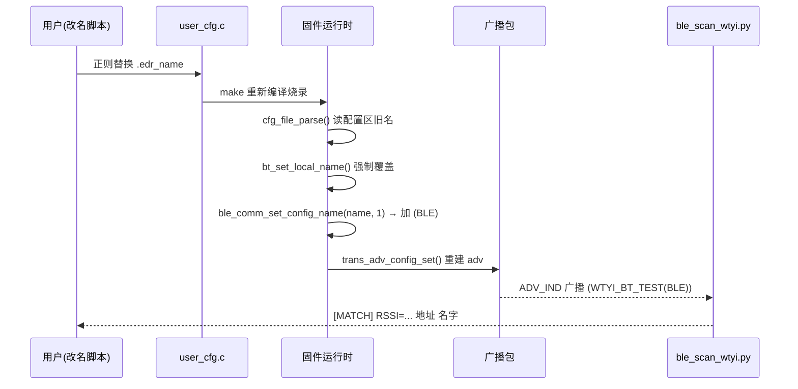
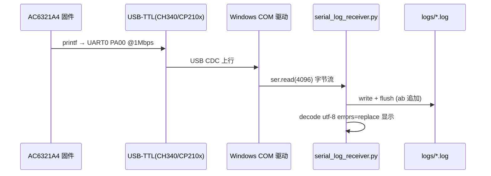

# 05 · 协议与数据流（Protocols & Dataflow）

> 重点：UART 日志格式（从 logs 与脚本反推）、串口参数、BLE 广播数据、完整数据流。所有结论尽量给出"证据"，反推的标【根据日志/代码推断】。

---

## 1. UART 日志格式（从 logs 反推）

### 1.1 固件 SDK 日志（结构化）

从 `logs/ac63_uart_gui_20260717_102150.log` 头部实测：

```text
[00:00:19.497][Info]: [SPP_AND_LE]app_key_evnet: 1,9
[00:00:20.368][Info]: [GATT_SERVER]adv_en:0
[00:00:20.373][Info]: [GATT_COMM]ble name(17): WTYI_BT_TEST(BLE)
[00:00:20.374][BLE_TRANS]trans_adv_data(26):
02 01 06 03 03 30 AF 12 09 57 54 59 49 5F 42 54
5F 54 45 53 54 28 42 4C 45 29
```

**格式拆解**【根据日志推断】：
```
[HH:MM:SS.mmm][Level]: [Module]message
```
- `HH:MM:SS.mmm`：上电后的相对运行时间（非墙钟时间，因为从 00:00:19 开始）。
- `[Info]`：日志级别（Info 为主）。
- `[Module]`：模块 TAG，如 `SPP_AND_LE`、`GATT_SERVER`、`GATT_COMM`、`BLE_TRANS`。
- 消息体：`app_key_evnet: 1,9`、`adv_en:0`、`ble name(17): ...`。

**注意**：日志里还夹着大量 `IPP`、`PIPP`、`P` 等**短 ASCII 碎片**【根据日志推断】——这不是协议字段，而是高波特率下多 printf 源交错 / 或某处 `printf` 被切成不完整片段后 UTF-8 解码的结果（详见 `08` 问题 1）。

### 1.2 作者自定义打印（`[WTYI]` 前缀）

来自固件源码（非推断）：
```c
// app_main.c:126
printf("[WTYI] UART heartbeat %lu, bt_name=WTYI_BT_TEST, baud=1000000\r\n", ++cnt);
// app_main.c:234-236
printf("[WTYI] AC63 SPP+LE firmware start\r\n");
printf("[WTYI] BT name target: WTYI_BT_TEST\r\n");
printf("[WTYI] UART log: TX=PA00, baud=1000000\r\n");
// app_main.c:141（硬件自检）
printf("[WTYI_HW][ADC] VBAT=%lu mV, VBG=%lu mV, PB1_RAW=%lu, PB1=%lu mV\r\n", ...);
```
- 前缀 `[WTYI]` 被 GUI 用来做**关键字高亮**（`uart_print_gui.py:187` `tag = "match" if "WTYI" in text`）。
- 换行符是 `\r\n`（CRLF），这是串口终端的常见约定。

### 1.3 日志文件格式（接收端生成）

- `serial_log_receiver.py:42-45`：文件名 `ac63_uart_%Y%m%d_%H%M%S.log`，**无**启动分隔头。
- `jieli_uart_logger.py:54`：每次启动写一行 `===== 2026-... =====` 分隔头（两版工具差异）。
- 落盘是**原始字节**（`"ab"` 模式），解码发生在"显示"阶段（`errors=replace`），所以文件里可能混有非 UTF-8 字节。

---

## 2. 串口参数

| 参数 | 值 | 证据 / 说明 |
| --- | --- | --- |
| TX 引脚 | PA00（UART0） | `README_UART_LOG.md:7`、`serial_log_receiver.py:6`、`app_main.c:236` |
| 波特率 | **1000000**（1 Mbps） | `README_UART_LOG.md:8`、`serial_log_receiver.py:23` `DEFAULT_BAUD = 1_000_000`、`02_receive_COM8_1000000.bat` |
| 数据位/校验/停止位 | 8N1（默认） | 脚本未显式指定 `bytesize/parity/stopbits`，pyserial 默认 8N1【根据代码推断，待本人确认】 |
| 超时 | 0.2 s（读超时） | `serial_log_receiver.py:56`、`uart_print_gui.py:151` |
| 每次读取量 | 4096 字节 | `serial_log_receiver.py:60`、`uart_print_gui.py:157` |
| 默认 COM | COM8 | `serial_log_receiver.py:24` `DEFAULT_PORT = "COM8"` |
| 硬件链路 | 板 PA00/TX → USB-TTL RXD；GND 共地 | `README_UART_LOG.md:12-15` |
| RX | 未使用（只收不发） | `README_UART_LOG.md:9` |

**接线红线**（`UART_DEBUG_README.txt:15-17`）：不要接 USB-TTL 5V/VCC 到板 IO；板已由 USB-C 供电时不要接 USB-TTL VCC。

---

## 3. BLE 广播数据（从日志反推 adv 包结构）

日志里的广播数据 hex dump：
```
trans_adv_data(26):
02 01 06 03 03 30 AF 12 09 57 54 59 49 5F 42 54 5F 54 45 53 54 28 42 4C 45 29
```

按 BLE AD（Advertising Data）结构拆解【根据日志 + BLE 规范推断】：
| 字节 | 含义 |
| --- | --- |
| `02 01 06` | AD 长度 2 + 类型 0x01(Flags) + 值 0x06（LE General Discoverable + BR/EDR Not Supported） |
| `03 03 30 AF` | AD 长度 3 + 类型 0x03(Complete List of 16-bit UUIDs) + UUID `0x30AF`（杰理透传服务，小端显示） |
| `12 09 ...` | AD 长度 0x12(18) + 类型 0x09(Complete Local Name) + 名字字节 |
| `57 54 59 49 5F 42 54 5F 54 45 53 54 28 42 4C 45 29` | ASCII = `WTYI_BT_TEST(BLE)`（含 `(BLE)` 后缀） |

**关键结论**：
- 名字 `WTYI_BT_TEST` 之后追加 `(BLE)` 是 `ble_comm_set_config_name(name, add_ble_ext_name=1)` 干的（`ble_trans.c:812-816, 822`）。
- 动态改名后长度变化可见：`ble name(17)` vs `ble name(19)`（`WTYI_BT_TEST` 12 字符 vs `WTYI_BT_TEST_B` 14 字符 + `(BLE)` 4 字符），`trans_adv_data(26)` vs `(28)`——名字变长，adv 包总长同步变长。
- 广播包 buffer 上限 31 字节（`ble_trans.c:119` `ADV_RSP_PACKET_MAX`），名字过长会截断/放不下。

**BLE 扫描端拿到什么**（`ble_scan_wtyi.py`）：`adv.local_name`（广播名）、`adv.rssi`（信号强度）、`device.address`（MAC）。

---

## 4. 完整数据流（端到端）

### 4.1 改名 → 广播被扫到



### 4.2 日志从芯片到文件



---

## 5. 数据流设计要点（面试可展开）

1. **固件 → PC 的契约只有"文本日志 + BLE 广播"**，工具集不依赖厂商私有协议，可测试性强。
2. **落盘与显示分离**：文件存原始字节（保真），显示阶段才 decode（容错），两版工具都遵循此原则。
3. **日志的时间戳是固件加的**（`[HH:MM:SS.mmm]`），PC 端不篡改时间，避免时钟不同步问题；但文件名用 PC 墙钟（`%Y%m%d_%H%M%S`）——两个时间体系并存，需要区分。
4. **hex dump 是固件打的**（`trans_adv_data(26)` 由 `ble_trans.c` 的 log 打印），不是 PC 解析的——这说明作者在固件侧就做了"可观测性埋点"。

---

## 6. 尚无证据 / 待确认项

- 8N1 是 pyserial 默认，**未**在脚本里显式声明【待本人确认】。
- `IPP`/`PIPP` 碎片的**确切来源**未在源码中找到对应 `printf("IPP")`，判定为接收伪影【根据日志推断，待本人确认】。
- 日志中的 `app_key_evnet: 2,9` 语义属于 SDK 内部事件码，未深挖【属厂商代码，不展开】。
