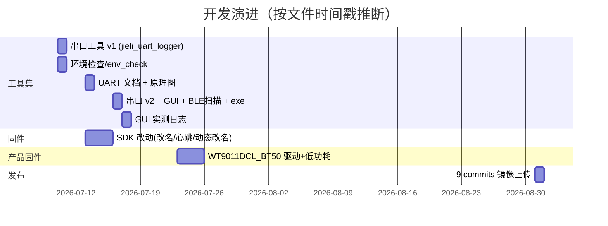

# 14 · 开发历史（Development History）

> 从 `git log` 重建 9 个 commit 的分批上传轨迹，并从文件时间戳/版本迭代推断真实演进。**注意区分"提交时间"和"开发时间"**。

---

## 1. git log 全貌（9 个 commit）

```
7f76d24 chore: 补传 2 个 tone 工具二进制（bd19 配置工具）
c373b91 chore: 补传被误排除的 3 个 tone 工具二进制，忽略空检出目录
4e9bd19 docs: 更新 README 反映完整目录结构与免责声明
15c3b7e chore: 入库工具链安装包、CodeBlocks IDE、Python 依赖包与截图
a50b5e6 chore: 入库固件工程 WT9011DCL_BT50_FW
f00e34b chore: 入库固件工程副本 gitee_fw-AC63_BT_SDK_official_burn
932bb23 chore: 入库固件工程副本 gitee_fw-AC63_BT_SDK_clean
c2425f1 chore: 入库杰理 SDK（fw-AC63_BT_SDK 完整工程）
a0b32b6 feat: 新增杰理 AC632N 开发工具集（构建/烧录/UART调试/日志GUI/日报自动化）
```

**HEAD** = `7f76d24d2968b4efe3f2ee5df2913f0e16a687a9`，共 **9** 个 commit，作者 `meminehobe24435-cmyk`。

---

## 2. 关键观察：提交时间 vs 文件时间

- **所有 commit 日期都是 2026-08-31**（镜像上传日），说明这是**分批把本地工作区一次性推到 GitHub 的镜像**，不是逐日开发提交。
- **文件时间戳是 2026-07-10 ~ 07-23**（真实开发期）：
  - `python_tools/jieli_uart_logger.py` → 07-10（最早的串口工具）。
  - `sdk/`、`CodeBlocks/`、`tools/`、`env_check/` → 07-10。
  - `debug_tools/schematic/`、`README_UART_LOG.md` → 07-13。
  - `debug_tools/*.py`、`build_uart_gui/`、`dist/` → 07-16。
  - `logs/` → 07-16 ~ 07-17（GUI 实测日志）。
  - `work/` → 07-23（产品固件 WT9011DCL_BT50_FW）。

**结论**：真实开发集中在 **7 月上旬到下旬**，8 月底才打包成 9 个 commit 上传（与任务描述"9 个左右 commit（分批上传镜像形成）"一致）。

---

## 3. 上传轨迹解读（commit 顺序 = 上传顺序，非开发顺序）

| commit | 内容 | 解读 |
| --- | --- | --- |
| `a0b32b6` | feat：工具集（bat/ps1/python/mjs/spec/exe/logs/截图） | **第一批**：先上传"自研工具集"这个最核心、最想展示的部分 |
| `c2425f1` | 入库 SDK 完整工程 | **第二批**：补上传厂商 SDK（体积最大，3349 文件） |
| `932bb23` / `f00e34b` | 入库 SDK 的 clean / official_burn 副本 | **第三、四批**：固件工程副本 |
| `a50b5e6` | 入库产品固件 WT9011DCL_BT50_FW | **第五批**：真实产品固件（含独立 `.git`） |
| `15c3b7e` | 入库工具链安装包/IDE/Python 包/截图 | **第六批**：本地依赖（CodeBlocks、pi32 安装包、python_pkgs） |
| `4e9bd19` | 更新 README 完整目录 + 免责声明 | **第七批**：把 README 补全为"镜像级"说明 |
| `c373b91` / `7f76d24` | 补传被误排除/缺失的 tone 工具二进制 | **第八、九批**：修复 `.gitignore` 误排除和杀软隔离缺失文件 |

**推导**：上传顺序是"**先核心价值（工具集）→ 再依赖（SDK/工具链）→ 再文档 → 最后补漏**"，这本身就是一次有规划的镜像发布。

---

## 4. 从版本迭代反推的演进（文件时间戳 + 代码差异）

### 4.1 串口工具的三代演进

| 版本 | 文件 | 时间 | 特征 |
| --- | --- | --- | --- |
| v1 | `python_tools/jieli_uart_logger.py` | 07-10 | 最简：`--list/--hex`，启动写 `=====` 分隔头 |
| v2 | `debug_tools/serial_log_receiver.py` | 07-16 | 落盘版：时间戳文件名、`--raw`、默认 COM8、`SerialException` 退出码 2 |
| v3 | `debug_tools/uart_print_gui.py` | 07-16 | GUI：多线程 + 队列 + 高亮，配 PyInstaller 打包 |

**证据**：三个文件功能逐层叠加（列口 → 落盘 → GUI），时间戳从 07-10 到 07-16 递进。

### 4.2 蓝牙改名的三段演进（最能体现"踩坑-迭代"）

| 阶段 | 代码 | 证据 |
| --- | --- | --- |
| ① 简单改 `.edr_name` | `user_cfg.c:44` `.edr_name = "WTYI_BT_TEST"` | SDK 版 |
| ② 强制覆盖（解决配置区旧名） | `user_cfg.c:217-218` `bt_set_local_name("WTYI_BT_TEST", ...)` | SDK 版，日报 07/13 记录"旧名称覆盖"问题 |
| ③ 宏 + 写回配置区持久化 | `work/.../app_config.h:21` `WTYI_BT_CLASSIC_NAME` + `user_cfg.c:223-227` `syscfg_write` | 产品固件版，更工程化 |

**结论**：从"改默认值"到"运行时强制"再到"写回持久化 + 宏收敛"，是完整的根因驱动迭代。

### 4.3 动态改名的"调研 → 落地"轨迹

- **调研阶段**（日报 07/13）：梳理 `bt_set_local_name()` / `bt_get_local_name()` / adv 刷新 / BLE 重初始化关系，结论是"SDK 有基础接口，但没有一键封装"。
- **落地阶段**（`ble_trans.c:799-825`）：`wtyi_dynamic_ble_name_switch()` 实现"关广播→改名→重建→开广播"。
- **实机验证**（`logs/ac63_uart_gui_20260717_102150.log`）：日志里 `WTYI_BT_TEST` ↔ `WTYI_BT_TEST_B` 交替 + 广播包长度变化。

### 4.4 产品固件的独立演进（07-23 之后）

- `work/WT9011DCL_BT50_FW` 含独立 `.git`，说明产品固件是**单独一个 git 仓库**，后以"工作区镜像"身份被纳入本仓库。
- `project_docs/` 下文档（`low_power_design.md`、`hardware_map.md`、`rename_build_report.md`、`baseline_build_report.md`、`conflict_report.md`、`build_low_power_report.py` 等）说明产品固件有**独立的工程文档体系**。

---

## 5. 时间线总览



> 注：上图按文件时间戳**推断**，具体某文件的确切改动日期需以本地 git 原始历史为准（本镜像仓只保留了 9 个上传 commit）【待本人确认】。

---

## 6. 面试怎么讲这段历史

> 这个仓库的 git 历史只有 9 个 commit，而且都是 8 月 31 号同一天的——因为它是我把本地工作区**分批镜像上传**的结果，不是逐日提交。真正的开发在 7 月，你可以从文件时间戳看到演进轨迹：串口工具从"最简列口收数"（07-10）迭代到"落盘版"再迭代到"GUI 打包 exe"（07-16）；蓝牙改名从"改默认值"踩坑到"强制覆盖"再到产品固件里"写回配置区 + 宏收敛"。这段历史本身就能说明我是"边踩坑边迭代、最后才归档发布"的开发方式。
